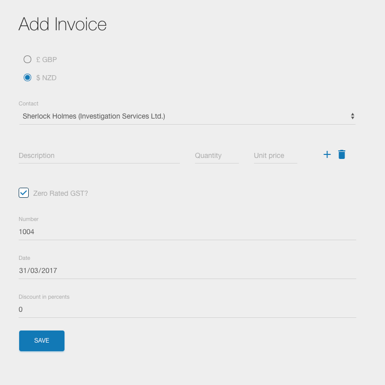
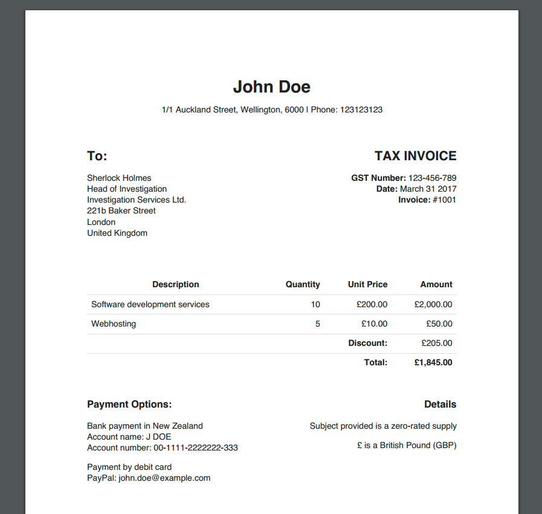

# Invoicing

*Like Xero, but shittier.*

Invoicing is an app for issuing invoices, track expenses and managing clients for all the sole traders of New Zealand. That are registered for GST. And can host a Rails app. And are able to configure Google OAuth.

## Installation

Do the usual like installing gems with bundler. Apart from that you need to install [wkhtmltopdf](https://github.com/wkhtmltopdf/wkhtmltopdf) for PDF generation.

Mac OS run the following:

```
brew cask install wkhtmltopdf
```

Ubuntu:

```
sudo apt-get install wkhtmltopdf
```

When using versions 0.12.4 and higher wkhtmltopdf doesn't run in a headless mode anymore. You need to do something like:

```
sudo apt-get install wkhtmltopdf
sudo apt-get install xvfb
printf '#!/bin/bash\nxvfb-run -a --server-args="-screen 0, 1024x768x24" /usr/bin/wkhtmltopdf -q $*' > /usr/bin/wkhtmltopdf.sh
chmod a+x /usr/bin/wkhtmltopdf.sh
ln -s /usr/bin/wkhtmltopdf.sh /usr/local/bin/wkhtmltopdf
wkhtmltopdf http://www.google.com output.pdf
```

### Google Authorization

Make yourself a project at [Google Console](https://cloud.google.com/console). In that project, go to the "APIs & auth" tab, then the "Credentials" tab. Create a new client ID of application type "Web application". Set the Authorized Redirect URI to `https://yoursite.com/google-callback`. You might want to put in `http://localhost:8080/google-callback` so you can test locally too.

### Configuration

After that you need to create a `config/database.yml`

```
default: &default
  adapter: postgresql
  encoding: unicode
  pool: 5

development:
  <<: *default
  database: invoicing_development

test:
  <<: *default
  database: invoicing_test

production:
  <<: *default
  database: invoicing_production
```

and `config/secrets.yml`

```
default: &default
  google_id: [google client id from google console]
  google_secret: [google client secret from google console]
  authenticated_email: [email used for google authentication]
  name: John Doe
  address: '1/1 Auckland Street, Wellington, 6000 | Phone: 123123123'
  gst_number: 123-456-789
  account_name: J DOE
  account_number: 00-1111-2222222-333
  paypal: john.doe@example.com
  gst_start: 2016-04-01
  gst_period_in_months: 6

development:
  <<: *default
  secret_key_base: [your secret key generated by bundle exec rake secret]
  google_redirect_url: http://localhost:8080/google-callback

test:
  <<: *default
  secret_key_base: [your secret key generated by bundle exec rake secret]

production:
  <<: *default
  secret_key_base: [your secret key generated by bundle exec rake secret]
  google_redirect_url: https://example.com/google-callback
```

### Development

The app is using unicorn configured with two workers to enable PDF generation with [PDFKit](https://github.com/pdfkit/pdfkit). To start the server run

```
bundle exec unicorn_rails -c config/unicorn.conf
```

## Screenshots

Dashboard with your current balance, taxes, expenses and everything sole trader might want to know to run a business.


A form to add invoice, making everything smooth and easy. UX expert approved!



A generated PDF invoice, your clients will be left speechless by the beauty of the typography and its kerning.



## Things to do

* move conversion rate to invoice and expense level
  * get it online from exchange API on addition
  * this will speed up the dashboard and calculations
  * also makes it more correct(tm)
* CSV export of invoices and expenses in financial year
